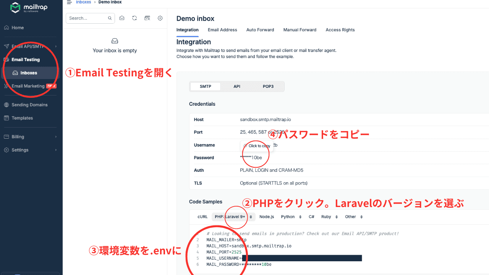
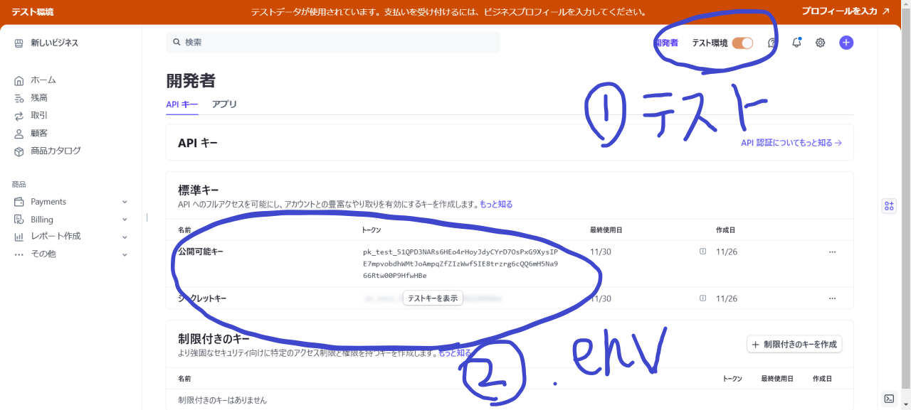
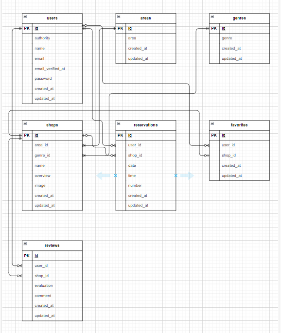

# Rese

## 環境構築
**Dockerビルド**
1. `git clone git@github.com:yuu-2-hue/rese.git`
2. DockerDesktopアプリを立ち上げる
3. `docker-compose up -d --build`

**Laravel環境構築**
1. `docker-compose exec php bash`

2. `composer install`

3. 「.env.example」ファイルを 「.env」ファイルに命名を変更。または、新しく.envファイルを作成

4. .envに以下の環境変数を追加
``` text
DB_CONNECTION=mysql
DB_HOST=mysql
DB_PORT=3306
DB_DATABASE=laravel_db
DB_USERNAME=laravel_user
DB_PASSWORD=laravel_pass
```
5. Mailtrapへログイン  
下記URLよりmailtrapへログイン  
<https://mailtrap.io/signin>
> *会員登録していない場合は登録してください*  

6. .envに追加する情報を取得  

``` text
1. 左のメニューから Email Testing を開く
2. PHP をクリックし、Laravel のバージョンを選ぶ
3. 環境変数をコピーし、Laravel プロジェクトの.env に貼り付ける
4. パスワードをコピーし、.env の該当場所に貼り付ける
```

7. .envに以下環境変数を追加
> XXXXは環境によって異なります。
``` text
MAIL_MAILER=smtp
MAIL_HOST=sandbox.smtp.mailtrap.io
MAIL_PORT=2525
MAIL_USERNAME=XXXX
MAIL_PASSWORD=XXXX
MAIL_ENCRYPTION=tls
MAIL_FROM_ADDRESS=test@example.com
MAIL_FROM_NAME="${APP_NAME}"
```

8. Stripeへログイン  
下記URLよりStripeへログイン  
<https://stripe.com/jp>
> *会員登録していない場合は登録してください*  

9. .envに追加する情報を取得

``` text
1. 実際に決済が実行されないようにテスト環境に設定
2. .env情報をコピーして.envに張り付ける
```

10. .envに以下環境変数を追加
``` text
STRIPE_PUBLIC_KEY="YOUR_PUBLIC_KEY"
STRIPE_SECRET_KEY="YOUR_SECRET_KEY"
```

11. Stripe PHPライブラリのインストール
``` bash
composer require stripe/stripe-php
```

12. AWSにログイン  
下記URLよりStripeへログイン  
<https://aws.amazon.com/jp>

13. 下記サイトを参考にバケットを作成  
<https://taishou.ne.jp/laravel-s3-connect/>

14. S3のパッケージインストール
``` bash
composer require league/flysystem-aws-s3-v3
```

15. .envに以下環境変数を追加  
※テストを実施する場合はテスト用の.envにも下記を追加してください
```
AWS_ACCESS_KEY_ID="YOUR_PUBLIC_KEY"
AWS_SECRET_ACCESS_KEY="YOUR_SEACRET_KEY"
AWS_DEFAULT_REGION="YOUR_REGION"
AWS_BUCKET="YOUR_BAKET_NAME"
AWS_URL=https://YOUR_BAKET_NAME.s3.amazonaws.com
```

16. アプリケーションキーの作成
``` bash
php artisan key:generate
```

17. マイグレーションの実行
``` bash
php artisan migrate
```

18. シーディングの実行
``` bash
php artisan db:seed
```
19. シンボリックリンク作成
``` bash
php artisan storage:link
```

### 使用技術
* PHP 7.4.9
* Laravel 8.0
* MySQL 8.0.26
* Mailtrap
* Stripe
* AWS S3
* AWS EC2
* AWS RDS

### ER図


### URL
* 開発環境：http://localhost
* phpMyAdmin：http://localhost:8080/
* パブリックIP:18.183.221.37

